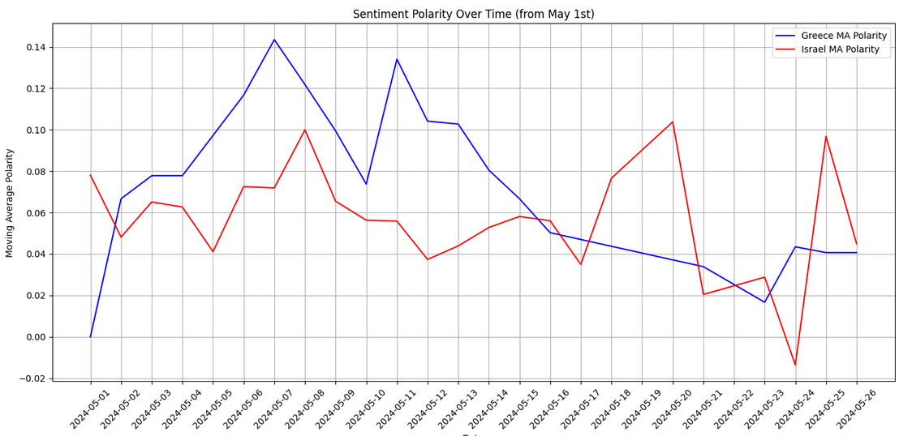

# 📊 Twitter Scraping και Ανάλυση Συναισθήματος για Ελλάδα και Ισραήλ στην  Eurovision 2024

Εισαγωγή

Η παρούσα μελέτη έχει στόχο την ανάλυση του συναισθήματος (sentiment analysis) των tweets που σχετίζονται με την Ελλάδα και το Ισραήλ σε σχέση με τον διαγωνισμό τραγουδιού της Eurovision 2024. Για την ανάλυση χρησιμοποιήθηκε γλώσσα προγραμματισμού  Python και η βιβλιοθήκη TextBlob, ενώ τα δεδομένα αντλήθηκαν μέσω scraping από το Twitter και αποθηκεύτηκαν σε CSV αρχείο στο Google Drive.

Η επιλογή του Ισραήλ ως μία από τις δύο υπό μελέτη χώρες έγινε διότι εκείνη την περίοδο βρισκόταν στην επικαιρότητα λόγω της έναρξης της σύγκρουσης στη Γάζα και των πολύνεκρων επιθέσεων της Χαμάς στο Ισραήλ. Αυτά τα γεγονότα ενίσχυσαν τη δημόσια συζήτηση και προκάλεσαν έντονες συναισθηματικές αντιδράσεις στα κοινωνικά δίκτυα. Η συμπερίληψή του στη μελέτη στοχεύει στην αποτύπωση αυτής της συναισθηματικής διακύμανσης, πάντα με σεβασμό προς τη σοβαρότητα των γεγονότων.

## 🔍 Περιγραφή

Το παρόν project αφορά τη συλλογή και αποθήκευση σχολίων από το Twitter γύρω από τη Eurovision 2024. Εστιάσαμε σε posts από 1 έως 15 Μαΐου 2024, τα οποία σχετίζονται με τα queries **"Eurovision"**, **"EBU"**, και hashtags όπως:  
`#SBSEurovision`, `#fucktheEBU2024`, `#Eurovision2024`, `#eurovisiongr2024`, `#eurovissionfuns`.  

Αρχικά, έγινε χρήση του  του αρχείου **`advance_scraper.py`** για εντοπισμό σχετικών posts με τουλάχιστον 10 απαντήσεις. Το αποτέλεσμα ήταν το αρχείο `Advance2024-05-25_04-20-19_tweets_1-15.csv`, το οποίο περιείχε **1208 posts**.

Στη συνέχεια, τα URLs των posts μοιράστηκαν σε 5 csv αρχεία (για καλύτερη διαχείριση) και χρησιμοποιήθηκε το **`scraper_commends_from_post.py`** για τη συλλογή των απαντήσεων (tweets) κάθε post.

---

## ⚙️ Προϋποθέσεις για Εκτέλεση

Ο χρήστης πρέπει:

- Να έχει εγκατεστημένο τον **Firefox browser**.
- Να κατεβάσει και εγκαταστήσει το [**geckodriver**](https://github.com/mozilla/geckodriver/releases) και να ορίσει σωστά την τοποθεσία του.
- Να εγκαταστήσει το **uBlock Origin** για αποκλεισμό διαφημίσεων κατά την πλοήγηση:  
  [uBlock Origin Add-on](https://addons.mozilla.org/en-US/firefox/addon/ublock-origin/)
- Να έχει τα αρχεία `tweet.py` και `scroller.py` στον ίδιο φάκελο με τα κύρια scripts.
- Ο χρήστης πρέπει να έχει λογαριασμό στο Twitter.
- Πρέπει να εισάγει τα στοιχεία του (username/email και password) μέσα στον κώδικα, στα κατάλληλα σημεία των αρχείων **advance_scraper.py** και **scraper_commends_from_post.py**.

---

## 📁 Περιγραφή Αρχείων

### ✅ `advance_scraper.py`
Κάνει scrape τα αρχικά tweets με βάση την αναζήτηση:

1. **Αρχικοποίηση:** Εισαγωγή βιβλιοθηκών (`selenium`, `pandas`, `tweet.py`, `scroller.py`).
2. **get_tweet_cards:** Συλλογή tweet καρτελών από τη σελίδα.
3. **save_to_csv:** Αποθήκευση των tweets σε `.csv` αρχείο.
4. **get_tweets:** Επιστρέφει τα συλλεγμένα tweets.
5. **WebDriver:** Ρυθμίσεις για τον Firefox + geckodriver + uBlock.
6. **Login:** Είσοδος στο Twitter με username & password.
7. **Αναζήτηση:** Εισαγωγή ερωτήματος και ενεργοποίηση του Scroller.
8. **Αποθήκευση:** Εξαγωγή των αποτελεσμάτων σε αρχείο CSV.

### ✅ `scraper_commends_from_post.py`
Διαβάζει τα URLs από τα αρχικά δεδομένα και κάνει scrape τα σχόλια κάθε post.

### ✅ `tweet.py`
Συλλέγει δεδομένα (author, time, content) από κάθε tweet καρτέλα.

### ✅ `scroller.py`
Χειρίζεται το scroll down της σελίδας ώστε να φορτωθούν νέα tweets.

---

### Μέρος Β

### Ανάλυση Συναισθήματος Tweets για Ελλάδα και Ισραήλ στο Eurovision 2024


#### 1. Φόρτωση των Δεδομένων

Χρησιμοποιήθηκε το Google Colab για την πρόσβαση στο Google Drive και την ανάγνωση του αρχείου `combined_unique_eurovision_valid.csv`. Στη συνέχεια δημιουργήθηκε μια λίστα από dictionaries που περιείχαν τα tweets και τα timestamps τους.

```python
from google.colab import drive
drive.mount('/content/drive')

query = pd.read_csv('/content/drive/MyDrive/combined_unique_eurovision_valid.csv')
tweets = [{'Tweet': row['Content'], 'Timestamp': row['Timestamp']} for index, row in query.iterrows()]
```

---

#### 2. Δημιουργία DataFrame και Καθαρισμός Δεδομένων

Τα tweets εισήχθησαν σε ένα DataFrame. Τα `NaN` αντικαταστάθηκαν με κενές συμβολοσειρές για αποφυγή σφαλμάτων.

```python
df = pd.DataFrame.from_dict(tweets)
df['Tweet'] = df['Tweet'].fillna('')
```

---

#### 3. Ορισμός Λέξεων-Κλειδιών

Δημιουργήθηκαν δύο λίστες με λέξεις-κλειδιά που σχετίζονται με την Ελλάδα και το Ισραήλ (όπως "Athens", "Greek culture" και "Tel Aviv", "Gaza" κλπ). Αυτές οι λίστες χρησιμοποιήθηκαν για να επισημάνουμε αν ένα tweet αναφέρεται σε κάποια από τις δύο χώρες.

---

#### 4. Αναγνώριση Θεματολογίας

Ορίστηκε συνάρτηση `identify_subject()` για να ελέγξει εάν ένα tweet περιέχει κάποια από τις λέξεις-κλειδιά.

```python
def identify_subject(tweet, refs):
    flag = 0
    for ref in refs:
        if ref.lower() in tweet.lower():
            flag = 1
    return flag

df['Israel'] = df['Tweet'].apply(lambda x: identify_subject(x, Israel_handle))
df['Greece'] = df['Tweet'].apply(lambda x: identify_subject(x, Greece_handle))
```

---

#### 5. Ανάλυση Συναισθήματος με TextBlob

Για κάθε tweet, υπολογίστηκε η πολικότητα (sentiment polarity) με χρήση της βιβλιοθήκης TextBlob. Η πολικότητα κυμαίνεται από -1 (αρνητικό συναίσθημα) έως +1 (θετικό συναίσθημα).

```python
from textblob import TextBlob
df['polarity'] = df['Tweet'].apply(lambda x: TextBlob(x).sentiment.polarity)
```

---

#### 6. Μετατροπή Timestamps και Ομαδοποίηση Κατά Ημερομηνία

Τα timestamps μετατράπηκαν σε τύπο ημερομηνίας και δημιουργήθηκε νέα στήλη με ημερομηνίες. Φιλτράραμε tweets από την 1η Μαΐου 2024 και έπειτα.

```python
df['Timestamp'] = pd.to_datetime(df['Timestamp'])
df['Date'] = df['Timestamp'].dt.date
start_date = pd.to_datetime('2024-05-01').date()
df = df[df['Date'] >= start_date]
```

---

#### 7. Υπολογισμός Ημερήσιας Πολικότητας & Κινητού Μέσου Όρου

Για κάθε χώρα:
- Φιλτράρονται τα tweets που την αφορούν.
- Ομαδοποιούνται κατά ημερομηνία.
- Υπολογίζεται ο μέσος όρος της πολικότητας ανά ημέρα.
- Υπολογίζεται και κινητός μέσος όρος (rolling mean) με παράθυρο 3 ημερών.

```python
Greece = df[df['Greece']==1][['Date', 'polarity']].groupby('Date').mean().reset_index()
Greece['MA Polarity'] = Greece.polarity.rolling(3, min_periods=1).mean()

Israel = df[df['Israel']==1][['Date', 'polarity']].groupby('Date').mean().reset_index()
Israel['MA Polarity'] = Israel.polarity.rolling(3, min_periods=1).mean()
```

 <p align="left">
    
 </p>
<p align="left">
    
 </p>
---

#### 8. Οπτικοποίηση Αποτελεσμάτων

Δημιουργήθηκε γράφημα γραμμής όπου αποτυπώνεται η πορεία του μέσου όρου πολικότητας ανά ημέρα και η μεταβολή του στο χρόνο.

```python
plt.plot(Greece['Date'], Greece['MA Polarity'], label='Greece MA Polarity', color='blue')
plt.plot(Israel['Date'], Israel['MA Polarity'], label='Israel MA Polarity', color='red')
plt.title('Sentiment Polarity Over Time (from May 1st)')
plt.xlabel('Date')
plt.ylabel('Moving Average Polarity')
plt.legend()
plt.grid(True)
plt.xticks(rotation=45)
plt.tight_layout()
plt.show()
```


---

#### Συμπεράσματα

Από την παραπάνω ανάλυση είναι δυνατή η παρακολούθηση της συναισθηματικής αντίδρασης του κοινού στα γεγονότα που αφορούν τις δύο χώρες κατά τη διάρκεια του διαγωνισμού. Η μεθοδολογία αυτή μπορεί να επεκταθεί για περισσότερες χώρες ή περιόδους, και να ενσωματώσει advanced NLP τεχνικές για πιο ακριβή κατανόηση των συναισθημάτων.

# 📊 Ανάλυση Συναισθηματικού Κλίματος (1 Μαΐου – 26 Μαΐου 2024)

<p align="left">
    
 </p>

Το γράφημα απεικονίζει την εξέλιξη της κινητής μέσης τιμής της συναισθηματικής πολικότητας (sentiment polarity) για την **Ελλάδα** και το **Ισραήλ**, από την 1η έως και την 26η Μαΐου 2024, αναδεικνύοντας τάσεις και μεταβολές στο δημόσιο συναίσθημα μέσα από τα δεδομένα της περιόδου.

Παρακάτω παρατίθενται τα κύρια γεγονότα που σημειώθηκαν σε αυτή την περίοδο, με συσχέτιση στις μεταβολές του συναισθηματικού κλίματος.

---

## 🇬🇷 Ελλάδα – Σημαντικά Γεγονότα και Ανάλυση

| Ημερομηνία | Γεγονός | Σύνδεσμος | Συσχέτιση με γράφημα |
|-----------|---------|-----------|------------------------|
| **06/05** | [Ανακοινώσεις για τη Μαρίνα Σάττι (Eurovision)](https://www.radiotimes.com/tv/entertainment/marina-satti-greece-eurovision-2024-profile-age-instagram/) | 📎 | Ανοδική τάση θετικής πολικότητας. |
| **07/05** | [Α' Ημιτελικός Eurovision ](https://program.ert.gr/details.asp?pid=3953653&chid=9) | 📎 | Κορύφωση θετικής πολικότητας (~0.14). |
| **09/05** | [Β' Ημιτελικός Eurovision – Συμμετοχή Ελλάδας](https://press.ert.gr/grafeio-typou-ert/eurovision-2024-me-tin-ellada-kai-ti-marina-satti-ston-v-imiteliko-pempti-9-ma-oy-2024-stis-22-00/) | 📎 | Σταδιακή κάμψη. |
| **10/05** | [Viral αντίδραση της Σάττι σε Ισραηλινή εκπρόσωπο](https://www.enikos.gr/media/eurovision-2024-marina-satti-oi-gkrimatses-to-chasmourito-kai-o-ypnos-tin-ora-pou-milouse-i-ekprosopos-tou-israil/2155051/) | 📎 | Άνοδος της θετικής πολικότητας. |
| **11/05** | [Τελικός Eurovision – Συμμετοχή Ελλάδας κατέκτησε την 11η θέση](https://www.protothema.gr/life-style/article/1496616/eurovision-2024-megalos-telikos-apotelesmata/) | 📎 | Πτώση της θετικής πολικότητας. |
| **12/05** | [Αντιδράσεις στους χορευτές της Μαρίνας Σάττι](https://www.protothema.gr/life-style/article/1496813/eurovision-suggnomi-zitoun-oi-horeutes-tis-marinas-satti-meta-tis-adidraseis-gia-ti-dilosi-tous-gia-tin-tourkia/) | 📎 | Μεγάλη πτώση της θετικής τάσης. |
| **Μετά τις 16/05** | — | — | Σταδιακή κάμψη / στασιμότητα στην πολικότητα. |

---

## 🇮🇱 Ισραήλ – Σημαντικά Γεγονότα και Ανάλυση

| Ημερομηνία | Γεγονός | Σύνδεσμος | Συσχέτιση με γράφημα |
|-----------|---------|-----------|------------------------|
| **06/05** | [Ισραηλινή εισβολή στη Ράφα](https://www.cnn.gr/kosmos/story/418037/rafa-me-to-daxtylo-sti-skandali-to-israil-nea-eksodos-xiliadon-amaxon) | 📎 | Μικρή πτώση ή στασιμότητα στην πολικότητα. |
| **13/05** | [Memorial Day – Πατριωτικά αισθήματα](https://www.timesofisrael.com/liveblog_entry/israels-ny-consul-at-memorial-day-event-every-single-household-knows-a-victim/) | 📎 | Μικρή άνοδος λόγω συλλογικού αισθήματος. |
| **17/05** | [Ανάκτηση σωρών 3 ομήρων από IDF](https://www.bankingnews.gr/index.php?id=738200) / [Israel Hayom](https://www.israelhayom.com/2024/05/17/israeli-forces-recover-bodies-of-3-captives-in-daring-gaza-raid/) | 📎 | Αισθητή άνοδος στην πολικότητα (συγκίνηση – εθνική ενότητα). |
| **20/05** | [Πτώση ελικοπτέρου προέδρου Ιράν  Ραϊσί – Ισραηλινή δήλωση](https://www.ieidiseis.gr/kosmos/247461/israil-den-riksame-emeis-to-elikoptero-oyte-dakry-gia-ton-raisi) | 📎 | Αισθητή πτώση στην πολικότητα. |
| **24/05** | [Ανάκτηση άλλων 3 σωρών ομήρων](https://www.bbc.com/news/articles/cjrr9wqjnveo) | 📎 | Νέα άνοδος στην πολικότητα – έντονη συγκίνηση. |

---

## 📌 Συμπεράσματα

- Η **Ελλάδα** εμφάνισε κορύφωση θετικού συναισθήματος στις 6–7 Μαΐου λόγω της Eurovision. Ακολούθησε κάμψη εξαιτίας αρνητικών αντιδράσεων στα παραλειπόμενα.
- Το **Ισραήλ** παρουσίασε **αντιφατικές τάσεις**: αρνητικά γεγονότα με πτώση πολικότητας (Ράφα, πόλεμος , πτώση ελικοπτέρου) συνέπεσαν με **αισθητή άνοδο** της πολικότητας σε ημερομηνίες όπου ανακοινώθηκε η ανάκτηση ομήρων (17 & 24 Μαΐου), πιθανόν λόγω **πατριωτικής υπερηφάνειας** και **ανακούφισης**.
- Το γράφημα αντικατοπτρίζει την **πολιτισμική επιρροή** στην περίπτωση της Ελλάδας και τη **συναισθηματική ένταση λόγω πολέμου** στην περίπτωση του Ισραήλ.


## ❗ Προβλήματα & Λύσεις

- 🔸 Τα προβλήματα που προκαλούσαν οι διαφημίσεις   στο scraping  επιλύθηκαν με χρήση του **uBlock**.
- 🔸 Το Twitter, ως **δυναμική σελίδα**, απαίτησε scrolling μέσω του `scroller.py`.

---

## 📦 Αποτελέσματα

- Συλλέχθηκαν 1208 post και 32.134 μοναδικα  tweets.
- Μετά το scraping των απαντήσεων, δημιουργήθηκε ένα σύνολο δεδομένων ιδανικό για **ανάλυση συναισθήματος**

